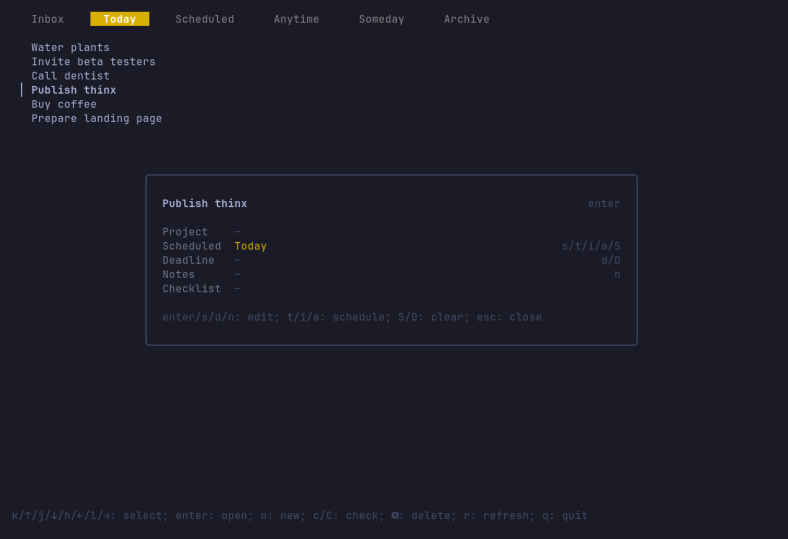

# thinx
thinx is a Things Cloud-compatible todo app for the terminal, running on Linux, macOS, and Windows.



## Getting Started
```sh
go install github.com/pkwagner/thinx/cmd/thinx@latest
```

Alternatively, binaries for Linux, macOS, and Windows are available on the [releases page](https://github.com/pkwagner/thinx/releases). 

## Features
- Create, view, and edit todos
- Auto-sync with Things Cloud
- Vim-ish keybindings -- no worries, arrow keys work too!

## Roadmap
- Integrations
  - [ ] Local provider
  - [ ] Self-hosted provider
- Core features
  - [ ] Edit support for projects and checklists (inside todos)
  - [ ] Evening schedule support
  - [ ] Todo reordering
  - [ ] Search & filter todos
  - [ ] Trash view / restore deleted todos
- App features
  - [ ] Remappable keybindings
  - [ ] CLI for integrating into Waybar etc.
  - [ ] Logout / database reset (workaround: delete config)
- Chore
  - [ ] Test behavior with multiple open windows
  - [ ] Add support for package managers: 
    - [ ] Homebrew
    - [ ] AUR
    - [ ] NixOS

## Related Projects
To the best of my knowledge, thinx is the first Things Cloud-compatible TUI. However, there are many other cool projects out there, some of which are:

| Name | Description |
|------|-------------|
| [things-cloud-sdk](https://github.com/arthursoares/things-cloud-sdk) | SDK and CLI for Things Cloud, which also powers thinx. Fork of nicolai86/things-cloud-sdk. No TUI.
| [things3-cloud](https://github.com/evanpurkhiser/things3-cloud) | Another SDK and CLI variant for Things Cloud written in Rust. No TUI.
| [things-cloud-mcp](https://github.com/wbopan/things-cloud-mcp) | MCP server, also using `things-cloud-sdk`. No TUI.
| [things-tui](https://github.com/jasongibby/things-tui) | TUI for Things 3 written in Python. No Things Cloud support, it instead uses the local Things database and therefore only runs on macOS.
| [things-cli](https://github.com/ryanlewis/things-cli) | Another CLI for Things 3 written in Go. No Things Cloud support either, local database and therefore macOS only.
